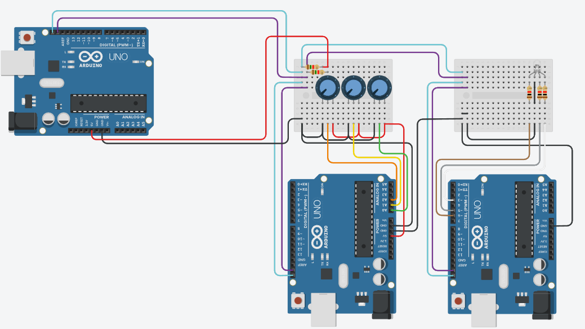

# RGB LED Steuerung mit Potenziometern über I2C
> Gruppe: Sophia, Kotaro, Kevin, Marius

## Inhalt
1.

## Schaltplan Aufbau
1. `SCL` & `SDA` aller Arduinos werden miteinander verbunden um Kommunikation zwischen Master und Targets über I2C zu ermöglichen
2. `SCL` & `SDA` werden mit `5V` von Master über Pull-Up-Widerstände (`1.5kΩ`) versorgt, um Signalleitungen während Inaktivität, auf definierten Pegel zu ziehen
3. Ground (GND) aller Arduinos werden miteinander verbunden, um konstantes, einheitliches Bezugspotenzial für Signale zu schaffen (*Sorgt für klare Interpretation der Daten*)

### Target 1 (Potenziometer Input)
1. Potenziometer werden mit `5V` versorgt und mit Ground (GND) verbunden, um einen geschlossenen Stromkreis zu bilden
2. Variable Spannungen der jeweiligen Potenziometer werden über Pins `A0`, `A1`, `A2` ausgelesen

### Target 2 (RGB LED Output)
1. RGB LED Beine mit PWM-Pins `~3`, `~5`, `~6` über `1.5kΩ` Widerstände verbinden, um Helligkeit jeweiliger Farben (rot, grün, blau) individuell anpassen und blenden zu können
2. RGB LED Kathode mit synchronisiertem Ground (GND) verbinden

*Schaltplan*